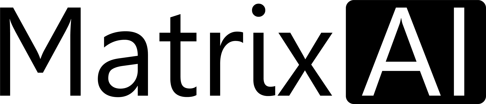
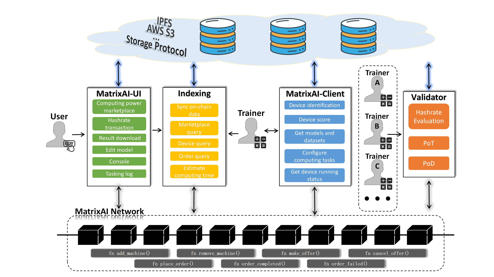

# 2023WXH-MatrixAI

<a href="readme_zh.md">Zh_Readme </a>  ·  <a href="docs/Demo.md">Demo </a>  · <a href="docs/Video_MatrixAI.mp4">Video </a>  ·  <a href="  ">Slides </a>  ·  <a href="docs/litepaper_v0.1.pdf">Litepaper </a>

# Table of Contents

- [Table of Contents](#Table-of-Contents)
- [Introduction](#Introduction)
  - [Background](#Background)
  - [Motivation](#Motivation)
  - [MatrixAI's Solution](#MatrixAIs-Solution)
- [What have we done](#What-have-we-done)
  - [Blockchain](#Blockchain)
  - [Client](#Client)
  - [Web](#Web)
- [Member information](#Member-information)

# Introduction

### Background

The global computing power scale is maintaining a high-speed and stable growth trend. The rapid rise of fields such as artificial intelligence, scientific research, and the metaverse poses higher demands on computing power. It is estimated that by 2030, the average annual growth rate of the global computing power scale will reach 65%.

However, we have to confront some issues.

- Expensive training costs: Ordinary computing devices might take a considerable amount of time to complete training tasks, hence the necessity for utilizing a cluster of computing resources. The cost of training the ChatGPT model in a single instance is approximately 4 million USD, with daily hardware expenses reaching around 700,000 USD. These steep prices are not favorable for startups and those sensitive to costs.
- Underutilized computing facilities: Data from the internet reveals that the global utilization rate of computing resources is around 20% to 30%. High-end servers are often distributed across various regions, and the idle computing resources are not being fully utilized.
- Vertical integration oligopolies monopolize the market: Indeed, highly centralized resources and data monopolies give monopolistic companies significant control over data and pricing power for computing power. This can create barriers to entry for smaller players and limit competition in the market.

### Motivation

The catalyst for every wave of technological innovation is the transformation of something expensive into something cheap enough to waste. Currently, in the field of physical infrastructure, the market is predominantly dominated by vertically integrated giants such as AWS, GCP, Azure, Nvidia, Cloudflare, Akamai, and others, which enjoy high profit margins in the industry. This results in high computational costs for newcomers in the AI field, especially in the LLM (Large Language Model) domain, which hinders the development and widespread adoption of AI technology. However, decentralized computing power services offer many advantages, such as decentralized resources, elasticity and scalability, cost reduction, privacy protection, high reliability, as well as opportunities for innovation and collaboration. We firmly believe that decentralized computing power services will be the key to overcoming the current high cost of computing power, making it affordable and readily available, thus opening the doors to technological innovation in the AI industry and shaping the future of the AI era.

To achieve this goal, we have taken the first step by establishing a decentralized AI computing power marketplace called MatrixAI, which aims to aggregate idle AI computing resources from around the world. The vision of MatrixAI is to attract computing power suppliers globally to participate in the network through fair and transparent incentive mechanisms, thereby establishing a vast pool of idle computing resources. We aim to build MatrixAI as an AI computing resource layer network in the Web3 era, providing support for both small-scale AI computing services and high-performance computing clusters to meet diverse demands.

MatrixAI is committed to breaking the current centralized monopoly, bringing innovation and progress to AI applications across various industries, and bringing greater openness and sustainability to AI computing power services, driving the entire industry to new heights. We believe that through the efforts of MatrixAI, computing power suppliers worldwide will be able to fully unleash their potential, while computing power consumers will have access to more flexible, efficient, and cost-effective AI computing solutions. We look forward to partnering with you to create a future full of potential in the decentralized computing power domain.

### MatrixAI's Solution

- How it works

- Nodes

  - *User*: Users with model training, inference needs & Users with computing power needs.
  - *Trainer*: Any user with idle computing resources can join the MatrixAI Network as a trainer without any barriers. Trainers act as consensus nodes in the network and earn block rewards by contributing valid computing power. Valid computing power can be accumulated through the following two methods:
    - *Drilling*: Completing measurable computing tasks([Model inference](https://cloud.google.com/bigquery/docs/inference-overview#:~:text=Machine%20learning%20inference%20is%20the,machine%20learning%20model%20into%20production.%22)) assigned by the network. Trainers can process such tasks in a streamlined manner upon joining the network. The computing tasks are published by projects collaborating with the MatrixAI Network and typically hold practical value. These tasks fall within the domain of machine learning and can be used to estimate the trainer's actual computing power. Additionally, due to their state independence, the computing tasks can be easily divided and verified, making them suitable for machines with various hardware conditions.
    - *Training*: Selling computing resources by placing orders on the computing power marketplace, entering into agreements with users, and completing the expected model training. Trainers who join the network can choose to place orders on the computing power marketplace at any time. Before initiating an order and determining the price, they can refer to the actual conditions in the computing power market. When users select a training machine, they can browse the reported key hardware configuration information of the machine, as well as its historical valid computing power values as a reference. Once the order is finalized, the trainer downloads the required data from the location specified by the user and completes the model training as requested.

- Authenticity guarantee
  - Consensus (PoH，Hashrate)

    PoH (Proof of Hashrate) is similar to Bitcoin's PoW (Proof of Work) in that both rely on the workload of consensus nodes to compete for block generation in each cycle. However, in PoH, trainers do not need to perform extensive hash calculations to find a hash value that meets certain conditions. Instead, they can calculate their valid computing power values through Drilling and Training. Additionally, PoH introduces the VRF (Verifiable Random Function) algorithm, which binds the valid computing power value of each trainer with the weight of the VRF. Trainers with higher computing power values have a higher probability of generating a random number that meets the criteria and obtaining the right to generate a block and associated rewards.
  - Computing Power Evaluation
   
    MatrixAI has built a computing power evaluation system based on PoT (Proof of Training) and PoD (Proof of Drilling). The computing power evaluation system dynamically assesses the computing power of each trainer and represents it in numerical form. It calculates the valid computing power values separately for Drilling and Training tasks. In a trustless computing power network, the computing power evaluation value can serve as one of the criteria for users to select services.
  - PoD

    PoD (Proof of Drilling) is designed to verify whether trainers have faithfully completed the Drilling tasks. The basic principle of PoD verification is to have multiple trainers perform the same task and return the same unit of work to reach a consensus. If they reach a consensus, the computing power will be calculated, and all trainers will receive the same amount of credit, regardless of their hardware conditions. Conversely, if multiple trainers produce different results for the same Drilling task, all participating trainers will lose that computing power value.
  - PoT
    
    "Don't trust, verify it"

    In a trustless computing power network, ensuring that computing power providers faithfully conduct model training is a crucial aspect. Through in-depth research, we have proposed Training Proof (PoT), which utilizes empirical comparisons to verify quantitative metrics such as accuracy and parameter distribution distances. It validates whether the intermediate checkpoints produced during the model training process match the output model. With the support of PoT, the training party generates a coherent proof package after training, and anyone who obtains the proof package can act as a verifier. Based on our proposed "all-pass rule," verifiers can assess whether the training party has faithfully completed the model training.

## What have we done

### Blockchain

- pallet-hashrate-market
  - Hashrate machine add function (`fn add_machine()`)
  - Hashrate machine removal function (`fn remove_machine()`)
  - Market pending order function (`fn make_offer()`)
  - Market cancel pending order function (`fn cancel_offer()`)
  - Place an order to purchase Hashrate function (`fn place_order()`)
  - order completion function (`fn order_completed()`)
  - Order failure function (`fn order_failed()`)

- pallet-order-manage
  - Order Delay
  - Order fulfilment rate
  
- Hashrate score
  - Hashrate Scoring Function

### Client

The client is a crucial component for trainers. Trainers simply need to deploy this client on their own machines, and the rest requires minimal effort. For instance, it will automatically join the MatrixAI network and list orders on the computing power marketplace. When a user places an order, the client will promptly initiate the order's task. Additionally, upon task completion, it will submit the results back to the marketplace.

The client can be divided into three modules: Device Share, Task Match, and Status Inquiry, as illustrated in the diagram below.

- MatrixAI-Client
  
  It is downloaded by the supplier providing computing power to the server for permanent operation. After running, configure the local machine on the chain, and subscribe to the order on the chain in real time.
  The main functions are as follows:
  - Get the configuration information and running status of the machine
  - Configuration and status data are submitted to the chain
  - After the user purchases computing power, the model and data are automatically downloaded to the local and the model is run
  - Start and stop computing tasks based on order data
  - Support running user-defined docker image tasks
    
The client is an application written in **go** and runs on the **linux** server. It needs to configure an account (including private key and address) for the first run, and the account needs to obtain a token in advance to pay the gas fee.

- Device-Score
  - Scoring the AI performance of a device

- MatrixAI-validator
  - Verify that the computing power provider trains as required and generates correct proofs

### Web 

 Matrix-UI is a web frontend application designed for users to access and navigate the computing power marketplace, as well as place orders online. The UI design of Matrix-UI can be found in this section and includes features such as wallet login and light client capabilities. The diagram below illustrates the architectural design.

- MatrixAI-UI
  - user server list
  - Server status query
  - Hashrate for sale
  - Hashrate transaction
  - Model data upload
  - Model training result download
  - order record
  - Task running log
  - More comprehensive device information

- MatrixAI-market-backend
  - device level classification
  - Log function
  - Enrich user experience

## Member information

|      Name     |            Role           | Personal profile  | 
| ------------- | ------------------------- | ----------- | 
| Dr.Jerry      | Product Manager           | Holds a Ph.D. degree with a focus on research areas such as information security, blockchain, etc. Senior AI expert Has extensive experience in large-scale projects related to federated learning and privacy-preserving computation. Formerly worked at a leading blockchain company      | 
| Miles Fan     | Full-stack Developer      | 5 years of development experience in the fields of AI and blockchain.Involved in the development of multiple AI and Web3 projects, with a focus on AI algorithms and data analysis         | 
| Baron Valaa   | AI Engineer               | Has in-depth expertise in machine learning and data analysis - Previously worked as a senior engineer at an artificial intelligence startup company         | 
| Thirteen chen | Smart Contract Developer  | Has extensive experience in distributed systems and smart contract development - Previously worked as a senior development engineer at a well-known blockchain company and participated in AI-based smart contract development projects         | 
