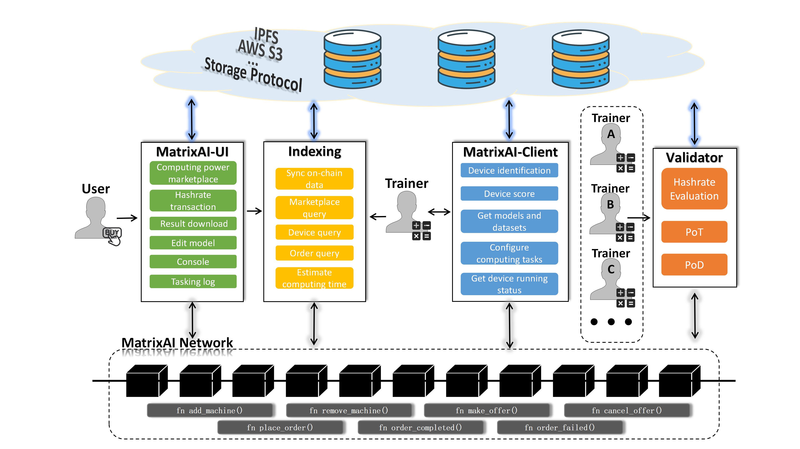
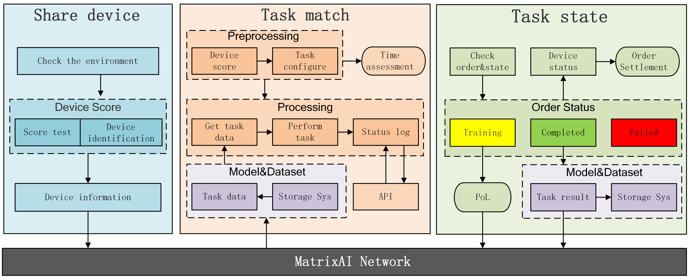
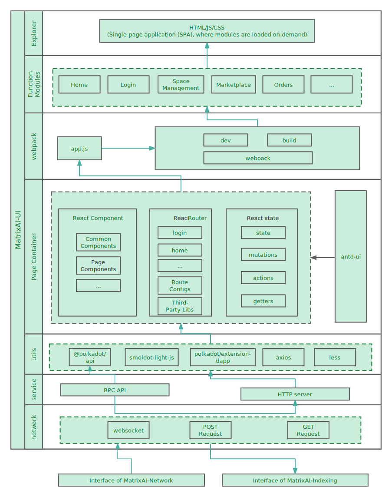

# 2023WXH-MatrixAI

 <a href="docs/Demo.md">示例 </a>  · <a href="docs/Video_MatrixAI.mp4">视频 </a>  ·  <a href="  ">幻灯片 </a>  ·  <a href="docs/litepaper_v0.1.pdf">白皮书 </a>

# 目录

- [目录](#目录)
- [介绍](#介绍)
  - [背景](#背景)
  - [动机](#动机)
  - [解决方案](#解决方案)
- [功能实现](#功能实现)
  - [区块链](#区块链)
  - [客户端](#客户端)
  - [网页](#网页)
- [成员信息](#成员信息)

# 介绍

### 背景

全球算力规模保持高速稳定增长趋势。人工智能、科学研究、虚拟宇宙等领域的快速崛起对算力提出了更高的要求。预计到2030年，全球算力规模年均增速将达到65%。

然而，我们必须面对一些问题。

- 昂贵的训练成本：普通的计算设备可能需要相当长的时间才能完成训练任务，因此需要利用集群的计算资源。单实例训练ChatGPT模型的成本约为400万美元，每天的硬件费用达到70万美元左右。这些高昂的价格对于初创公司和对成本敏感的公司来说并不有利。
- 计算设施利用不足：互联网数据显示，全球计算资源利用率约为20%至30%。高端服务器往往分布在各个地区，闲置的计算资源没有得到充分利用。
- 寡头垂直整合垄断市场：事实上，高度集中的资源和数据垄断使垄断公司对数据和计算能力的定价能力具有重大控制权。这可能会给较小的参与者造成进入壁垒并限制市场竞争。

### 动机

每一次技术创新浪潮的催化剂都是将昂贵之物转化为足够便宜以浪费的东西。目前，在物理基础设施领域，市场主要由垂直一体化的巨头主导，如AWS、GCP、Azure、Nvidia、Cloudflare、Akamai等，它们在行业内拥有高利润率。这导致了人工智能领域新进者，特别是在大型语言模型领域，面临高昂的计算成本，阻碍了人工智能技术的发展和广泛应用。然而，分散化的计算资源服务具有许多优势，如分散的资源、弹性和可扩展性、成本降低、隐私保护、高可靠性，以及创新和合作的机会。我们坚信，分散化的计算资源服务将是克服当前计算能力高成本的关键，使其变得负担得起且随时可用，从而打开人工智能行业的技术创新之门，塑造人工智能时代的未来。

为了实现这一目标，我们已经迈出了第一步，建立了一个名为MatrixAI的分散式人工智能计算力市场，旨在汇集来自世界各地的空闲AI计算资源。MatrixAI的愿景是通过公平和透明的激励机制吸引全球的计算力供应商参与网络，从而建立一个庞大的空闲计算资源池。我们的目标是在Web3时代将MatrixAI建设成为一个人工智能计算资源层网络，为小规模的人工智能计算服务和高性能计算集群提供支持，以满足各种需求。

MatrixAI致力于打破当前的中心化垄断，为各行业的人工智能应用带来创新和进步，为人工智能计算力服务带来更大的开放性和可持续性，推动整个行业迈向新的高度。我们相信，通过MatrixAI的努力，全球的计算力供应商将能够充分释放其潜力，而计算力消费者将能够获得更灵活、高效和具有成本效益的人工智能计算解决方案。我们期待着与您合作，共同创造一个充满潜力的分散化计算力领域的未来。

### 解决方案

- 架构

- 角色

  - *用户*: 模型训练和推断需求的用户以及计算力需求的用户。
  - *训练者*: 任何拥有空闲计算资源的用户都可以无障碍地加入MatrixAI网络作为训练节点。训练节点在网络中充当共识节点的角色，并通过提供有效的计算力来获得区块奖励。有效的计算力可以通过以下两种方法积累：
    - *“钻孔”*: 完成由网络分配的可度量的计算任务([模型推断]((https://cloud.google.com/bigquery/docs/inference-overview#:~:text=Machine%20learning%20inference%20is%20the,machine%20learning%20model%20into%20production.%22))。加入网络后，训练节点可以高效处理此类任务。这些计算任务由与MatrixAI网络合作的项目发布，通常具有实际价值。这些任务属于机器学习领域，可用于估计训练节点的实际计算能力。此外，由于它们的状态独立性，这些计算任务可以轻松分割和验证，适用于各种硬件条件的计算机。
    - *训练*: 通过在计算力市场上发布订单、与用户达成协议以及完成预期的模型训练来出售计算资源。加入网络的训练节点可以随时选择在计算力市场上发布订单。在启动订单并确定价格之前，他们可以参考计算力市场的实际情况。当用户选择一个训练机器时，他们可以浏览该机器报告的关键硬件配置信息，以及作为参考的其历史有效计算力数值。一旦订单确定，训练节点会从用户指定的位置下载所需数据，并按照要求完成模型训练。

- 真实性保证
  - 共识 (PoH，Hashrate)

    PoH（Proof of Hashrate）与比特币的PoW（Proof of Work）类似，因为两者都依赖于共识节点的工作负载，以竞争每个周期的区块生成。然而，在PoH中，训练节点不需要执行大量的哈希计算来找到满足特定条件的哈希值。相反，他们可以通过“Drilling”和“Training”计算其有效计算力数值。此外，PoH引入了VRF（可验证随机函数）算法，将每个训练节点的有效计算力值与VRF的权重绑定在一起。具有更高计算力值的训练节点具有更高的概率生成满足条件的随机数，从而获得生成区块和相关奖励的权利。
  - 计算能力评估
   
    MatrixAI已经构建了一个基于PoT（Proof of Training）和PoD（Proof of Drilling）的计算能力评估系统。这个计算能力评估系统动态地评估每个训练节点的计算能力，并以数字形式表示出来。它分别为Drilling和Training任务计算有效的计算力数值。在一个不需要信任的计算能力网络中，计算能力评估值可以作为用户选择服务的标准之一。这意味着用户可以根据训练节点的计算能力评估值来决定哪个节点最适合他们的需求，增加了网络的可信度和透明度。
  - PoD

    PoD（Proof of Drilling）旨在验证训练节点是否忠实地完成了“Drilling”任务。PoD验证的基本原理是让多个训练节点执行相同的任务并返回相同的工作单元以达成共识。如果它们达成共识，计算能力将被计算，无论他们的硬件条件如何，所有训练节点都将获得相同数量的信用。相反，如果多个训练节点为相同的“Drilling”任务产生不同的结果，所有参与的训练节点都将失去该计算力数值。这确保了任务的可信度和结果的一致性，并鼓励训练节点按照要求完成任务。这种方法有助于维护网络的可靠性和公平性。
  - PoT
    
    "Don't trust, verify it"

    在一个不需要信任的计算能力网络中，确保计算能力提供者忠实地进行模型训练是至关重要的方面。通过深入研究，我们提出了Training Proof（PoT），它利用经验性比较来验证诸如准确度和参数分布距离等定量指标。它验证了模型训练过程中产生的中间检查点是否与输出模型匹配。在PoT的支持下，训练方在训练后生成一个连贯的证明包，任何获得该证明包的人都可以充当验证者。基于我们提出的“全通规则”，验证者可以评估训练方是否忠实地完成了模型训练。

## 功能实现

### 区块链

- 算力市场
  - Hashrate machine add function (`fn add_machine()`)
  - Hashrate machine removal function (`fn remove_machine()`)
  - Market pending order function (`fn make_offer()`)
  - Market cancel pending order function (`fn cancel_offer()`)
  - Place an order to purchase Hashrate function (`fn place_order()`)
  - order completion function (`fn order_completed()`)
  - Order failure function (`fn order_failed()`)

- 订单管理
  - Order Delay
  - Order fulfilment rate
  
- 算力评分
  - Hashrate Scoring Function

### 客户端

客户端是训练节点的重要组成部分。训练节点只需将此客户端部署到自己的计算机上，其余工作需要的努力非常有限。例如，它会自动加入MatrixAI网络并在计算力市场上列出订单。当用户下达订单时，客户端将迅速启动订单的任务。此外，在任务完成后，它将将结果提交回市场。

客户端可以分为三个模块：设备共享、任务匹配和状态查询，如下图所示。

- MatrixAI-客户端
  
  
  算力的供应商将其下载到服务器上，以进行长期运行。运行后，本地计算机配置上链，并实时订阅链上的订单。
  其主要功能如下：
  - 获取计算机的配置信息和运行状态
  - 将配置和状态数据提交到链上
  - 用户购买算力后，模型和数据会自动下载到本地，然后运行模型
  - 基于订单数据启动和停止计算任务
  - 支持运行用户自定义的Docker镜像任务
    
  该客户端是使用**Go**编写的应用程序，运行在**Linux**服务器上。在首次运行时，需要配置一个账户（包括私钥和地址），并且这个账户需要提前获取一个代币以支付Gas费用。
- 设备评分
  - 评估计算机或设备的AI性能分数

- MatrixAI-验证器
  - 验证计算能力提供者是否按要求进行训练并生成正确的证明。

### 网页

  Matrix-UI是一个面向用户设计的Web前端应用程序，旨在让用户访问和浏览计算力市场，并在线下订单。Matrix-UI的用户界面设计包括钱包登录和轻客户端功能等特性。下图说明了其架构设计。

- MatrixAI-UI
  - 用户服务器列表
  - 服务状态查询
  - 算力出售
  - 算力交易
  - 模型数据更新
  - 模型训练结果下载
  - 订单查询
  - 计算任务日志
  - 更全面的设备信息

- MatrixAI-market-backend
  - 设备分类排序
  - 日志模块
  - 提高并丰富用户体验

## 成员信息

|      Name     |            Role           | Personal profile  | 
| ------------- | ------------------------- | ----------- | 
| Dr.Jerry      | Product Manager           | 拥有博士学位，专注于信息安全、区块链等研究领域。资深AI专家。有丰富的联邦学习，隐私计算的大型项目经验。曾任职于头部区块链公司      | 
| Miles Fan     | Full-stack Developer      | 在人工智能和区块链领域拥有5年的开发经验。参与多个AI和WEB3项目的开发，专注与AI算法和数据分析         | 
| Baron Valaa   | AI Engineer               | 在机器学习和数据分析领域有着深入的专业知识。曾在人工智能初创公司担任高级工程师     | 
| Thirteen chen | Smart Contract Developer  | 在分布式系统和智能合约开发方面有丰富的经验。曾任职于知名区块链公司担任高级开发工程师，并参与AI的智能合约开发项目        | 

