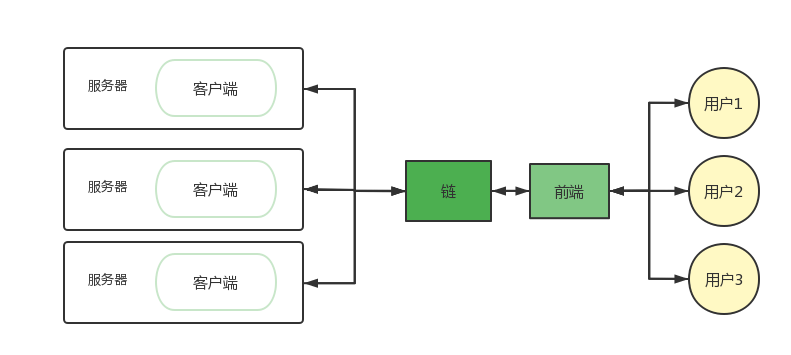

# MarketAI 框架与业务流程介绍

## 平台主要功能：
我们目标是提供一个算力(AI训练算力)交易平台，算力提供商通过平台出售闲置算力，有需要的用户通过平台购买算力时长来训练自己的AI模型，并支付相应费用给供应商。

## 角色：
1. 供应商：算力出售方
2. 平台方：连接供应商与用户的系统
3. 用户：算力需求方

## 项目主要有三大部分组成：
1. 客户端：运行于供应商服务器的驻留程序，用于算力数据上链，执行交易，订单处理等
2. 区块链：去中心化数据处理中心，算力信息、订单数据等存储中心
3. 前端UI：连接供应商与需求方的桥梁，供应商通过UI界面可以实现机器上架，下架，订单查看等，用户可以在market中挑选合适的算力服务器，并可以方便的下单购买和查看训练结果等。

## 基本架构图

## 三大部分介绍：

### 1.客户端
由提供算力的供应商下载到服务器常驻运行，运行后把本机配置上链，并实时订阅链上订单。
主要功能如下：
- 获取机器的配置信息和运行状态
- 配置和状态数据提交上链
- 用户购买算力后，自动把模型和数据下载到本地并运行模型
- 根据订单数据开启和停止运行计算任务

客户端是使用go编写的一个运行在linux服务器端的应用程序，首次运行需要配置一个账户（包括私钥和地址），账户需要提前获取token用于支付gas费。

### 2.区块链
- `pallet-hashrate-market`
  - 算力机器添加函数 (`fn add_machine()`)
  - 算力机器移除函数 (`fn remove_machine()`)
  - 市场挂单函数 (`fn make_offer()`)
  - 市场取消挂单函数 (`fn cancel_offer()`)
  - 下单购买算力函数 (`fn place_order()`)
  - 订单完成函数 (`fn order_completed()`)
  - 订单失败函数 (`fn order_failed()`)

### 3.前端
为用户提供数据可视化和操作平台
主要功能：
- 用户服务器列表
- 服务器状态查询
- 算力出售
- 算力交易
- 模型数据上传
- 模型训练结果下载
- 订单记录
